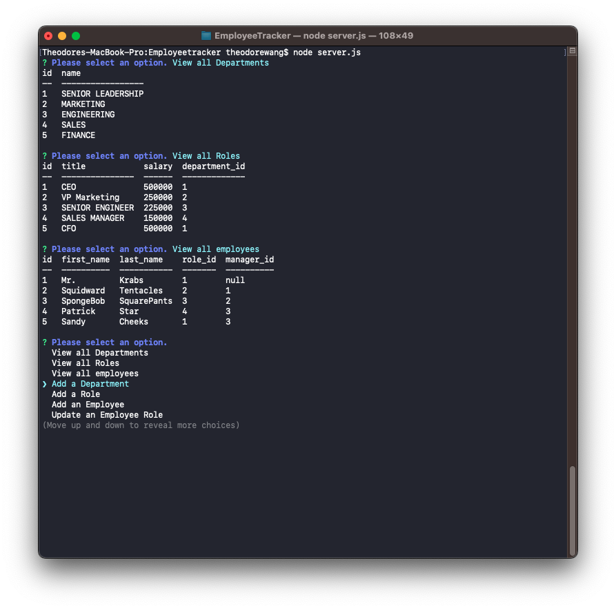

# EmployeeTracker

Create a command line app to manage an employee database. The user is able to view all departments, view all roles, view all employees, add a department, add a role, add an employee, and update an Employee Role. 

## Description
*On page load the user is presented with a menu of options. 

    *View all Departments: all of the departments are displayed.

    *View all Roles: all of the roles are displayed.

    *View all Employees: all of the employees are displayed. 

    *Add a Department: a new department can be added.

    *Add a Role: a new role can be added.

    *Add an Employee: a new employee can be added.

    *Update an Employee Role: an employee's role is changed.   

## Mock-up
The images below shows the webpage created

## Location
https://drive.google.com/file/d/1-ZzrO5yBg1q84JV1MhlaVi3uoC0UyBPT/view

## Credits
Database schema provided by University of Texas Coding Bootcamp

## License
MIT License

Copyright (c) 2022 Teddy Wang

Permission is hereby granted, free of charge, to any person obtaining a copy
of this software and associated documentation files (the "Software"), to deal
in the Software without restriction, including without limitation the rights
to use, copy, modify, merge, publish, distribute, sublicense, and/or sell
copies of the Software, and to permit persons to whom the Software is
furnished to do so, subject to the following conditions:

The above copyright notice and this permission notice shall be included in all
copies or substantial portions of the Software.

THE SOFTWARE IS PROVIDED "AS IS", WITHOUT WARRANTY OF ANY KIND, EXPRESS OR
IMPLIED, INCLUDING BUT NOT LIMITED TO THE WARRANTIES OF MERCHANTABILITY,
FITNESS FOR A PARTICULAR PURPOSE AND NONINFRINGEMENT. IN NO EVENT SHALL THE
AUTHORS OR COPYRIGHT HOLDERS BE LIABLE FOR ANY CLAIM, DAMAGES OR OTHER
LIABILITY, WHETHER IN AN ACTION OF CONTRACT, TORT OR OTHERWISE, ARISING FROM,
OUT OF OR IN CONNECTION WITH THE SOFTWARE OR THE USE OR OTHER DEALINGS IN THE
SOFTWARE.